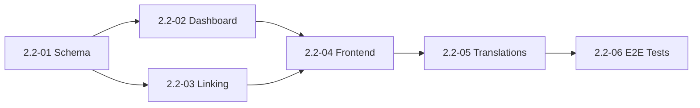

# Phase 2.2: Risk Status Enhancement

## Objective

Simplify risk status to 3 meaningful values with proper business logic enforcement:

| Status | Purpose | Dashboard | Controls/KRI | Linkage |
|--------|---------|-----------|--------------|---------|
| **Active** | Current identified risks under management | ✅ Included | ✅ Can link | ✅ Default filter |
| **Emerging** | Market/country risks being monitored (not yet affecting us) | ❌ Excluded | ❌ Cannot link | Separate view |
| **Archived** | Soft-deleted risks (approved deletion) | ❌ Excluded | ❌ Cascade unlink | Hidden by default |

## Current State Analysis

### Backend (`app/models/risk.py`)

```python
class RiskStatus(str, Enum):
    active = "active"
    monitoring = "monitoring"  # ← To be removed
    closed = "closed"          # ← To be removed
    archived = "archived"
```

### Current Usage

- **Dashboard filters**: Only exclude `archived`
- **Snapshot service**: Special handling for `closed` count
- **Frontend filter**: Shows "Active/Mitigated/Closed" (naming mismatch)
- **Default filter**: Empty (shows all except archived)

### Impact Areas

1. **Backend enum** - Reduce to 3 values
2. **Database migration** - Map old values to new
3. **Dashboard endpoints** - Filter emerging from aggregations
4. **Quarterly comparison** - Exclude emerging from snapshots
5. **Frontend types** - Update TypeScript enum
6. **Risk list filter** - Default to Active, add Emerging option
7. **Control/KRI linking** - Block linking to non-Active risks
8. **Translations** - Update CS/EN for new status names

---

## Phase Breakdown

### Plan 2.2-01: Backend Schema & Migration

**Scope**: 3-4 hours | **Risk**: Medium (data migration)

**Tasks**:

1. Update `RiskStatus` enum: `active`, `emerging`, `archived`
2. Create Alembic migration:
   - Map `monitoring` → `emerging`
   - Map `closed` → `archived`
3. Update schema validators in `RiskCreate`, `RiskUpdate`
4. Add tests for status transition validation

**Verification**:

- [ ] Migration runs without data loss
- [ ] Existing risks have valid status values
- [ ] API rejects invalid status values

---

### Plan 2.2-02: Dashboard & Aggregation Updates

**Scope**: 2-3 hours | **Risk**: Low

**Tasks**:

1. Update all dashboard endpoints to filter `status == 'active'`:
   - `/dashboard/` metrics
   - `/dashboard/risks-by-cell`
   - `/dashboard/risk-committee`
   - `/departments/{id}` counts
2. Update snapshot service:
   - Remove `closed` count logic
   - Exclude `emerging` from all snapshots
3. Update quarterly comparison to only count Active risks

**Verification**:

- [ ] Dashboard only shows Active risks
- [ ] Emerging risks don't appear in any aggregations
- [ ] Department pages show correct Active-only counts

---

### Plan 2.2-03: Control & KRI Linking Enforcement

**Scope**: 2 hours | **Risk**: Medium

**Tasks**:

1. Add validation in `ControlRiskLink` creation:
   - Reject linking to `emerging` or `archived` risks
2. Add validation in `KRI` creation/update:
   - Reject linking to non-Active risks
3. Handle status transitions:
   - When Active → Emerging: Warn but allow (existing links preserved)
   - When Active → Archived: Links soft-deleted with risk

**Verification**:

- [ ] Cannot create new links to Emerging risks
- [ ] Cannot create new links to Archived risks
- [ ] Existing links preserved when risk becomes Emerging
- [ ] Links cascade-deleted when risk becomes Archived

---

### Plan 2.2-04: Frontend Types & API Updates

**Scope**: 2 hours | **Risk**: Low

**Tasks**:

1. Update `frontend/src/types/risk.ts`:

   ```typescript
   export type RiskStatus = 'active' | 'emerging' | 'archived';
   ```

2. Update `riskApi.ts` default filter parameter to `status=active`
3. Update filter options in `RisksPage.tsx`:
   - Default to "Active"
   - Options: "All", "Active", "Emerging"
   - Hide "Archived" (only visible to admins)

**Verification**:

- [ ] Risk list defaults to Active filter
- [ ] Emerging filter shows only emerging risks
- [ ] TypeScript compiles without errors

---

### Plan 2.2-05: UI Labels & Translations

**Scope**: 1-2 hours | **Risk**: Low

**Tasks**:

1. Update EN translations:
   - `risks.status.active`: "Active"
   - `risks.status.emerging`: "Emerging"
   - `risks.status.archived`: "Archived"
2. Update CS translations:
   - `risks.status.active`: "Aktivní"
   - `risks.status.emerging`: "Vznikající"
   - `risks.status.archived`: "Archivované"
3. Update Risk form wizard status step
4. Add Emerging status styling (amber/yellow theme)

**Verification**:

- [ ] All status labels render correctly in EN/CS
- [ ] Status badges have correct colors
- [ ] No hardcoded status strings remain

---

### Plan 2.2-06: E2E Tests & Documentation

**Scope**: 1-2 hours | **Risk**: Low

**Tasks**:

1. Add E2E tests:
   - Creating risk with each status
   - Filtering by status
   - Linking controls to Active-only
2. Update `docs/BUSINESS_LOGIC.md` with status rules
3. Update administrator documentation

**Verification**:

- [ ] All E2E tests pass
- [ ] Documentation reflects new status behavior

---

## Execution Order



## Success Criteria

1. ✅ Only 3 status values exist: `active`, `emerging`, `archived`
2. ✅ Dashboard shows only Active risks
3. ✅ Emerging risks visible in Risk Register with Emerging filter
4. ✅ Controls/KRIs can only link to Active risks
5. ✅ Default Risk list filter is "Active"
6. ✅ All existing data migrated correctly
7. ✅ E2E tests verify business logic

## Rollback Plan

If critical issues discovered:

1. Restore database from pre-migration backup
2. Revert to previous enum values via hotfix migration
3. Frontend tolerates unknown status values gracefully
