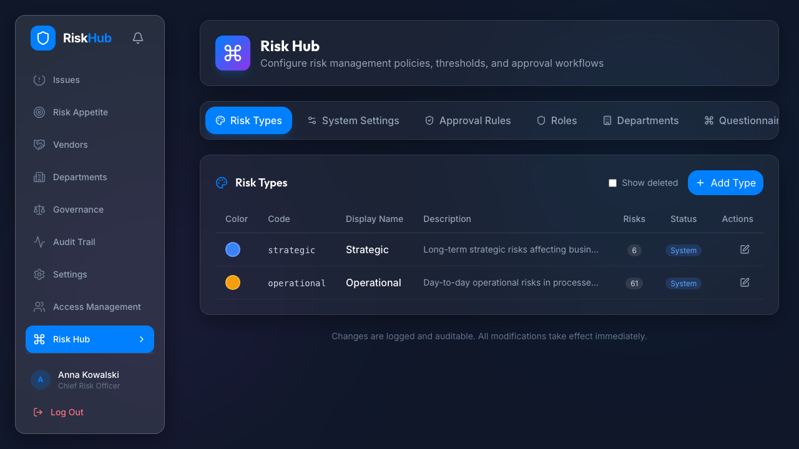

# RiskHub

<p align="center">
  <strong>Enterprise risk operations for teams that need governed change, clear ownership, and audit-ready visibility.</strong>
</p>

<p align="center">
  RiskHub brings risks, controls, KRIs, vendors, approvals, and platform operations into one workflow-driven surface built for real enterprise use, not slideware.
</p>

<p align="center">
  <a href="#quick-start"><strong>Quick Start</strong></a>
  ·
  <a href="#stack-at-a-glance"><strong>Architecture / Stack</strong></a>
  ·
  <a href="#documentation-map"><strong>Documentation</strong></a>
</p>

## Open Source Status

RiskHub is published as an open-source repository under the [MIT License](./LICENSE).

- Contributions are accepted through forks, issues, and pull requests.
- Security issues should follow [SECURITY.md](./SECURITY.md), not public issue threads.
- The contribution workflow and verification expectations live in [CONTRIBUTING.md](./CONTRIBUTING.md).
- Merges to `main` are maintainer-controlled. Public PRs are welcome, but merge authority is intentionally restricted.

## What It Looks Like

<table>
  <tr>
    <td width="50%">
      
    </td>
    <td width="50%">
      
    </td>
  </tr>
  <tr>
    <td valign="top">
      <strong>Designed for serious operating environments</strong><br />
      The product surface is positioned around enterprise risk management, secure access, and role-aware navigation instead of generic dashboard chrome.
    </td>
    <td valign="top">
      <strong>Governance is built into the product</strong><br />
      Risk Hub configuration, approval rules, departments, and role structures are part of the operating model rather than external admin debt.
    </td>
  </tr>
  <tr>
    <td colspan="2">
      
    </td>
  </tr>
  <tr>
    <td colspan="2" valign="top">
      <strong>Approval workflows stay visible</strong><br />
      Notifications, approvals, decision notes, and queue triage are first-class workflows, so sensitive changes do not disappear into email or side-channel process.
    </td>
  </tr>
</table>

## Why RiskHub

- **Run the full risk operating loop in one place.** RiskHub covers the register, controls, KRIs, issues, departments, and vendor-linked exposure instead of splitting posture across disconnected tools.
- **Make approval-gated change normal.** Sensitive edits become structured approval requests with rationale, resolution notes, and auditability instead of silent mutations.
- **Keep third-party risk connected to core posture.** Vendors link directly to risks, controls, and KRIs, with grouped views and create-from-vendor flows for real operating context.
- **Turn dashboards into decisions.** The dashboard is built for drill-downs, scoped evidence exports, stored committee snapshots, and missing-data transparency, not vanity metrics.
- **Run risk assessments as governed workflow.** Risk questionnaires have backend-enforced action capabilities, one-open-questionnaire protection, clarifications, deadlines, and owner-aware batch sending.
- **Manage remediation to closure.** Issues include remediation progress, exception handling, expiry/revoke behavior, and closure validation tied to completed remediation evidence.
- **Respect RBAC and scope boundaries.** Business access, admin access, department scope, manager scope, and ownership exceptions are explicit product behavior, not implied conventions.
- **Support operators as well as business users.** Platform admins get a separate documentation and runbook surface for health checks, access support, evidence capture, and escalation-safe operations.

## Built For Real Operating Workflows

RiskHub is aimed at teams that need governance to survive contact with production:

- CROs, risk managers, compliance, internal audit, and department heads who need a live view of posture, ownership, and remediation pressure
- Business users who need clear workflows for risks, controls, KRIs, issues, notifications, and approvals
- Vendor and outsourcing stakeholders who need third-party exposure tied back to enterprise risks and monitoring
- Platform admins who need health, access, audit, and incident-support runbooks without becoming accidental business-data superusers

This repository already reflects those boundaries in product behavior and documentation:

- business users and admins have separate documentation libraries
- approvals, notifications, questionnaires, remediation, and KRI value governance are first-class workflows
- dashboard, committee snapshots, exports, and activity evidence are operational surfaces
- local development and production deployment are deliberately separated

## Quick Start

Recommended for most people: use the Docker onboarding path.

```bash
./scripts/install.sh demo
```

Then open `http://localhost/login`.

If you need a deterministic Docker-backed reset for browser verification and seeded demo data:

```bash
./scripts/install.sh demo --reset test
```

Use the canonical startup guide for current caveats, reset behavior, and environment details:

- [Development startup guide](./docs/development/README.md)

## Local Development

Use local runtimes when you are actively iterating on backend or frontend code.

```bash
./scripts/install.sh dev
```

What this path gives you:

- Docker-backed PostgreSQL and Redis infrastructure
- local backend on `http://localhost:8000`
- local Vite frontend on `http://localhost:5173`
- demo-friendly auth defaults for development

Contributor notes:

- Docker is still part of the supported local workflow
- Node major `24` is the expected local frontend runtime
- `./scripts/install.sh` remains the supported public entrypoint even though it now delegates internally to `./scripts/install_cli.py` and `./scripts/install_lib/`
- production deployment remains separate and should use `./scripts/install.sh production --target docker|linux`

## Stack At A Glance

| Layer | Technology |
|---|---|
| Frontend | React 19, TypeScript, Vite, React Query, Recharts |
| Backend API | FastAPI, SQLAlchemy asyncio, Pydantic |
| Data | PostgreSQL, Alembic |
| Runtime services | Redis, APScheduler |
| Testing | pytest, Vitest, Playwright |
| Delivery model | Docker-first onboarding, separate production deployment workflows |

## Product Surface

RiskHub is not just a CRUD shell around a risk register. The documented operating surface includes:

- **Dashboard and reporting** for posture review, drill-downs, filters, exports, and committee-ready summaries
- **Risks and controls** for ownership, scoring, mitigation, execution logging, and evidence
- **KRIs** for thresholds, reporting cadence, one-value-per-period history, approval-gated corrections, overdue tracking, and breach status
- **Issues** for remediation lifecycle, exception handling, readiness validation, and closure evidence
- **Risk questionnaires** for assessment requests, batch sending, clarifications, deadlines, and questionnaire inbox triage
- **Approvals and notifications** for queued changes, decision review, request cancellation, and workflow triage
- **Vendors** for third-party register management, flag grouping, and linked risk/control/KRI context
- **Admin operations** for platform health, access support, scoped exports, incident triage, and escalation handoff

## Testing And Verification

Use the smallest relevant verification path for the surface you touch:

```bash
make -f scripts/Makefile test
cd frontend && npm run test:run
cd frontend && npx tsc --noEmit
make -f scripts/Makefile test-e2e
```

For Postgres-sensitive backend behavior, E2E notes, and the current deterministic test guidance, use the canonical docs:

- [Testing guide](./docs/TESTING.md)
- [E2E testing guide](./docs/E2E_TESTING.md)

## Documentation Map

Start here depending on what you need:

- [Development startup](./docs/development/README.md)
- [Full documentation index](./docs/README.md)
- [Business logic and RBAC reference](./docs/BUSINESS_LOGIC.md)
- [User workflows](./docs/user/README.md)
- [Platform admin runbooks](./docs/admin/README.md)
- [Deployment and production operations](./docs/deployment/README.md)
- [Testing matrix](./docs/TESTING.md)

## Repository Layout

| Path | Purpose |
|---|---|
| `backend/` | FastAPI application, services, models, migrations, backend tooling |
| `frontend/` | React application, frontend services, tests, and build tooling |
| `docs/` | User, admin, deployment, testing, and reference documentation |
| `scripts/` | Local development, Docker onboarding, deployment, and quality entrypoints |
| `tests/` | Centralized backend and frontend test suites and test artifacts |

## Deployment

Production deployment is intentionally separate from local startup and Docker onboarding.

Use:

```bash
./scripts/install.sh production --target docker|linux
```

Day 2 operations:

```bash
./scripts/install.sh status --mode production --target docker|linux
./scripts/install.sh logs --mode production --target docker|linux --tail 200 --follow
./scripts/install.sh doctor --mode production --target docker|linux [--repair]
./scripts/install.sh upgrade --target docker|linux
```

Operator contract notes:

- `./scripts/install.sh` stays the public shell surface for `production`, `upgrade`, `status`, `logs`, and `doctor`
- the lifecycle control plane behind it now lives in `./scripts/install_cli.py` and `./scripts/install_lib/`
- production runtime expects an explicit `ALLOWED_HOSTS` allowlist; see the deployment docs before rollout

Before touching production, read:

- [Deployment overview](./docs/deployment/README.md)
- [Security checklist](./docs/deployment/security-checklist.md)

## Source Of Truth

This README is the GitHub-facing project landing page. For operational truth, prefer the canonical docs:

- startup and contributor workflows: [docs/development/README.md](./docs/development/README.md)
- business behavior and permissions: [docs/BUSINESS_LOGIC.md](./docs/BUSINESS_LOGIC.md)
- user-facing workflows: [docs/user/README.md](./docs/user/README.md)
- admin operations: [docs/admin/README.md](./docs/admin/README.md)
