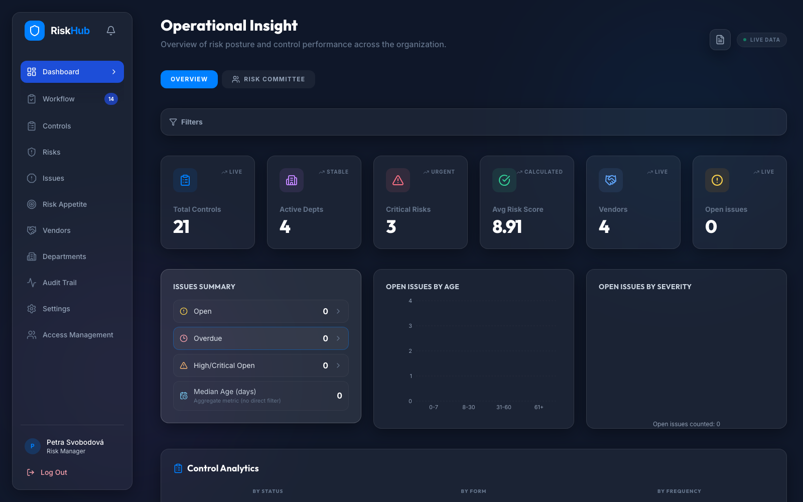
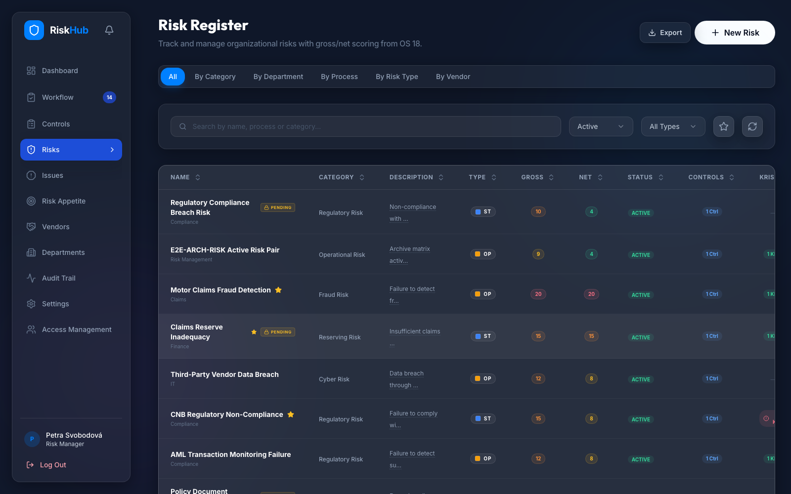
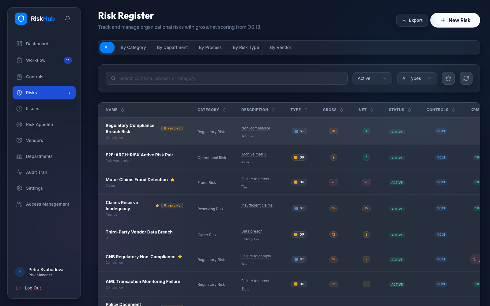
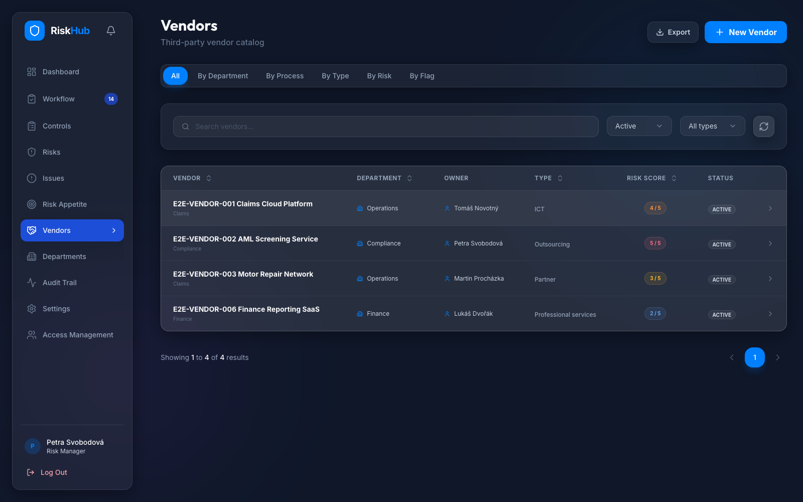
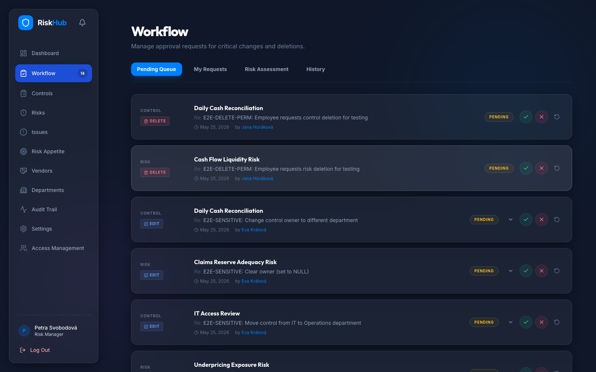
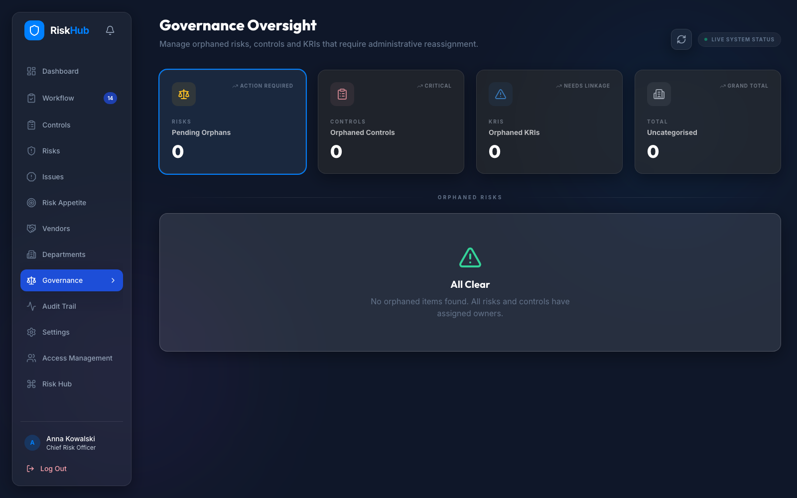
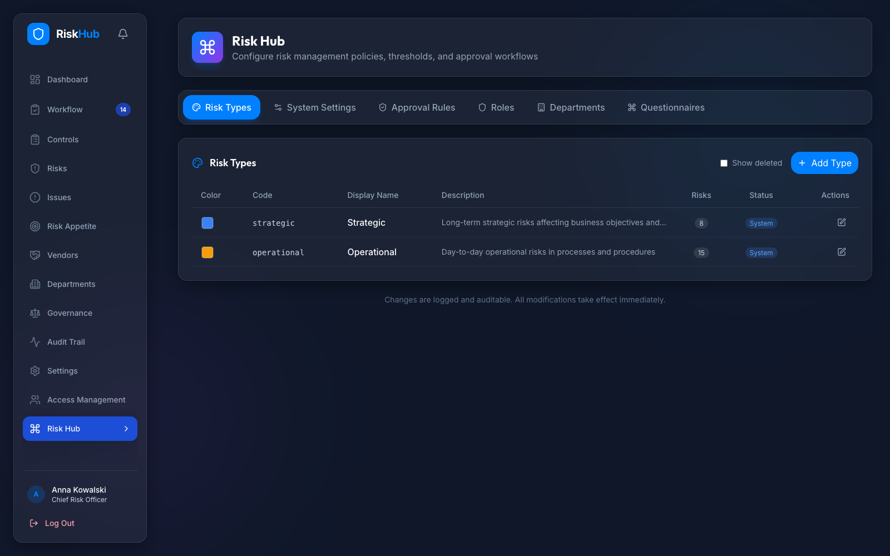
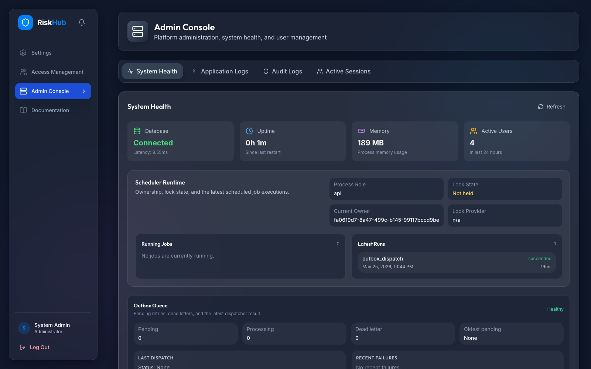

# RiskHub

<p align="center">
  <a href="https://github.com/W1z4rd1c4/RiskHub/releases"></a>
  <a href="./LICENSE"></a>
  <a href="https://github.com/W1z4rd1c4/RiskHub/actions/workflows/lint.yml"></a>
  <a href="https://github.com/W1z4rd1c4/RiskHub/actions/workflows/e2e.yml"></a>
  <a href="https://github.com/W1z4rd1c4/RiskHub/actions/workflows/security.yml"></a>
</p>

<p align="center">
  <strong>Open-source risk operations for teams that need ownership, approvals, evidence, and operating clarity in one place.</strong>
</p>

<p align="center">
  RiskHub is designed to help risk, compliance, audit, vendor, and platform teams run the daily work around risks, controls, KRIs, issues, approvals, and governance without falling back to spreadsheet handoffs.
</p>

<p align="center">
  <a href="#quick-start"><strong>Quick Start</strong></a>
  ·
  <a href="#how-riskhub-works"><strong>Product Tour</strong></a>
  ·
  <a href="#architecture"><strong>Architecture</strong></a>
  ·
  <a href="#documentation"><strong>Documentation</strong></a>
  ·
  <a href="./CONTRIBUTING.md"><strong>Contribute</strong></a>
  ·
  <a href="./SUPPORT.md"><strong>Support</strong></a>
</p>

<p align="center">
  
</p>

## Why RiskHub

Risk work gets messy when the register, controls, vendor context, approvals, remediation, and evidence all live in different places. RiskHub brings those workflows into one product surface so teams can see who owns the work, what changed, what still needs approval, and where evidence lives.

RiskHub is built for teams that need:

- a governed risk register with owners, departments, statuses, scoring, and linked work
- controls, KRIs, issues, vendors, and questionnaires connected to the same operating model
- approval-gated change for sensitive updates
- activity history, audit logs, exports, and dashboard evidence for reviews
- separate user manuals and admin runbooks for business users and platform operators

## Evaluate RiskHub

RiskHub is a self-hosted, Docker-first application for evaluating a governed risk operations workflow with local data and deterministic demo fixtures. There is no hosted demo URL at this time; the supported evaluation path is the local Docker demo below.

RiskHub is a good fit to evaluate when your team wants:

- a risk and control workspace that includes vendors, KRIs, issues, approvals, evidence, and governance review
- local control of the application, database, demo data, and deployment path during evaluation
- an open-source codebase with visible CI, security scanning, release checks, and operating documentation
- a product surface that risk, compliance, audit, vendor, and platform operators can inspect together

It is not positioned as a hosted SaaS trial. If you need support routing before opening an issue, start with [SUPPORT.md](./SUPPORT.md).

## Quick Start

Use the Docker onboarding path for the fastest local demo. This is the primary public evaluation path until a hosted demo exists.

```bash
./scripts/install.sh demo
```

Then open `http://localhost/login`.

For deterministic seeded data before screenshots, E2E checks, or product review:

```bash
./scripts/install.sh demo --reset test
```

For local development with Docker-backed infrastructure and local backend/frontend runtimes:

```bash
./scripts/install.sh dev
```

Production deployment is intentionally separate from local startup:

```bash
./scripts/install.sh production --target docker|linux
```

Current startup details, reset behavior, and local runtime notes live in the [development guide](./docs/development/README.md).

## How RiskHub Works

### 1. Run the risk operating loop

RiskHub gives teams one place to review risk posture, triage the register, connect controls and KRIs, and follow linked work into the right detail page.



The same workflow continues on detail pages, where linked controls, KRIs, vendors, issues, and history stay close to the risk record instead of becoming side-channel notes.



### 2. Keep third-party risk connected

Vendors are not a separate spreadsheet. Vendor pages support ownership, risk scoring, DORA/significance indicators, and linked exposure panels where the workflow needs them.



### 3. Put sensitive change through approvals

RiskHub supports approval queues, notifications, decision notes, and activity evidence so important changes do not disappear into chat or email.



### 4. Resolve governance gaps and run the platform

Governance review helps teams resolve orphaned or incomplete records, while platform admins get a separate admin console for operational checks, sessions, logs, and support workflows.



Risk Hub configuration keeps the risk operating model visible to the CRO workflow, including appetite, monitoring, approval, questionnaire, and reminder settings.





## Product Surface

RiskHub includes workflows for:

- **Dashboard and reporting**: posture review, drill-downs, dashboard filters, committee snapshots, and exports where the app exposes export controls
- **Risks and controls**: ownership, scoring, mitigation, execution logging, linked context, and evidence
- **KRIs**: thresholds, reporting cadence, value history, overdue tracking, breach status, and approval-aware corrections
- **Issues and remediation**: assignments, progress, exceptions, expiry/revoke behavior, validation, and closure evidence
- **Risk questionnaires**: assessment requests, deadlines, clarifications, submission review, and questionnaire inbox workflows
- **Approvals and notifications**: queued changes, request cancellation, decision review, and workflow triage
- **Vendors**: third-party register management, flags, grouped views, and linked risk/control/KRI context
- **Admin operations**: health, logs, sessions, access support, documentation, and operational runbooks

## Architecture

| Layer | Technology |
|---|---|
| Frontend | React 19, TypeScript, Vite, React Query, Recharts |
| Backend API | FastAPI, SQLAlchemy asyncio, Pydantic |
| Data | PostgreSQL, Alembic |
| Runtime services | Redis, APScheduler |
| Testing | pytest, Vitest, Playwright |
| Delivery model | Docker-first onboarding, separate production deployment workflows |

Repository layout:

| Path | Purpose |
|---|---|
| `backend/` | FastAPI app, services, models, migrations, backend tooling |
| `frontend/` | React app, frontend services, unit tests, and browser tooling |
| `docs/` | User manuals, admin runbooks, deployment, testing, and reference docs |
| `scripts/` | Local development, Docker onboarding, deployment, and quality entrypoints |
| `tests/` | Centralized backend, frontend, E2E, and test artifact structure |

## Operational Confidence

RiskHub keeps public evaluation signals close to the repository:

- MIT licensing and public contribution guidance live at the root of the repository.
- Security reporting, leak-audit guidance, dependency scanning, and CI security workflows are documented and versioned.
- Deterministic screenshot assets are generated from the demo app, not hand-made mockups.
- Release publication is gated by the release workflow and release parity checks before a public tag is published.

## Verification

Use the smallest check that matches the work you changed:

```bash
make -f scripts/Makefile test
cd frontend && npm run test:run
cd frontend && npx tsc --noEmit
make -f scripts/Makefile test-e2e
```

For the current test matrix and deterministic E2E guidance, see:

- [Testing guide](./docs/TESTING.md)
- [E2E testing guide](./docs/E2E_TESTING.md)

## Documentation

Start here:

- [Documentation index](./docs/README.md)
- [User manuals](./docs/user/README.md)
- [Platform admin runbooks](./docs/admin/README.md)
- [Business logic and RBAC reference](./docs/BUSINESS_LOGIC.md)
- [Development startup](./docs/development/README.md)
- [Deployment and production operations](./docs/deployment/README.md)
- [Security checklist](./docs/deployment/security-checklist.md)
- [Agent documentation index](./docs/agent/README.md)

README screenshots are generated from the demo app. The asset manifest and capture command live in [docs/assets/readme](./docs/assets/readme/README.md).

## Open Source Status

RiskHub is published under the [MIT License](./LICENSE).

- Contributions are handled through forks, issues, and pull requests.
- Security issues should follow [SECURITY.md](./SECURITY.md), not public issue threads.
- Contribution expectations and verification notes live in [CONTRIBUTING.md](./CONTRIBUTING.md).
- Support routing for Q&A, bugs, features, and operations lives in [SUPPORT.md](./SUPPORT.md).
- Public PRs are welcome; merges to `main` remain maintainer-controlled.

## Source Of Truth

This README is the GitHub-facing landing page. For operating truth, prefer the canonical docs:

- startup and contributor workflows: [docs/development/README.md](./docs/development/README.md)
- business behavior and permissions: [docs/BUSINESS_LOGIC.md](./docs/BUSINESS_LOGIC.md)
- user-facing workflows: [docs/user/README.md](./docs/user/README.md)
- admin operations: [docs/admin/README.md](./docs/admin/README.md)
