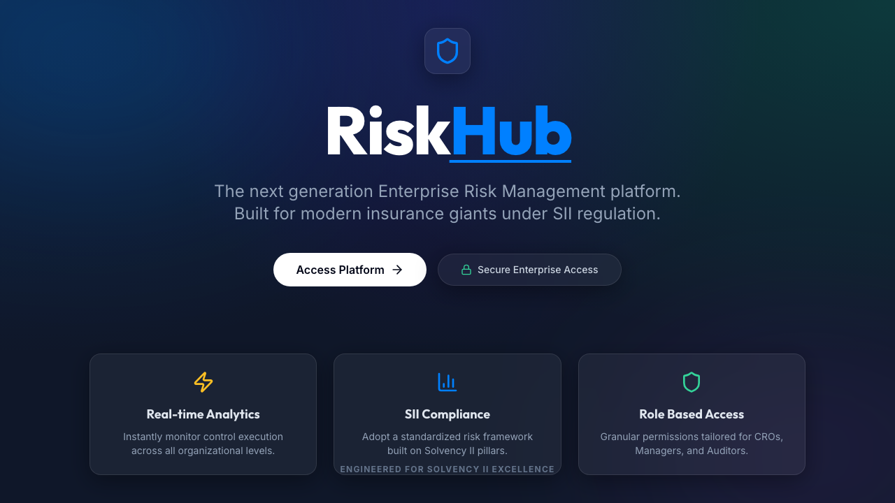
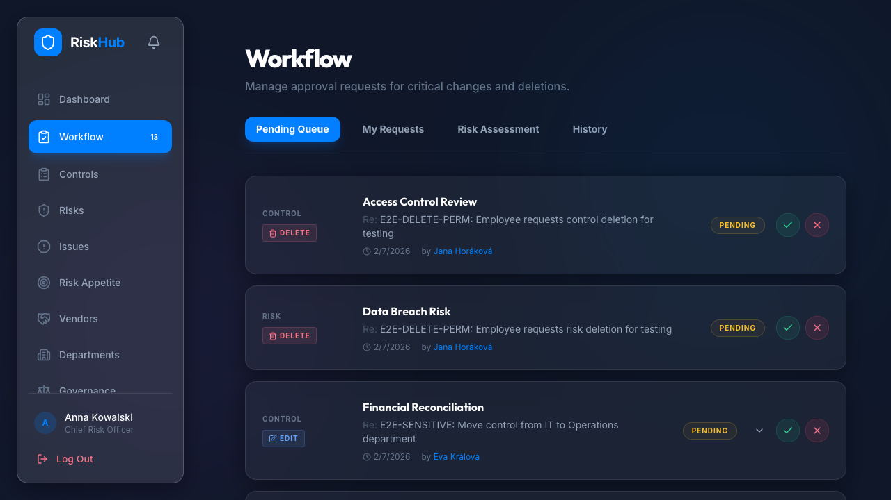

# RiskHub

<p align="center">
  <a href="./LICENSE"></a>
  <a href="./CONTRIBUTING.md"></a>
  <a href="./SECURITY.md"></a>
  <a href="./docs/README.md"></a>
</p>

<p align="center">
  <strong>Enterprise risk operations, approval-gated governance, and audit-ready visibility in one open-source platform.</strong>
</p>

<p align="center">
  RiskHub brings risks, controls, KRIs, vendors, approvals, reporting, and platform operations into a workflow-driven system designed for real operating environments rather than spreadsheet sprawl.
</p>

<p align="center">
  <a href="#quick-start"><strong>Quick Start</strong></a>
  ·
  <a href="#why-riskhub"><strong>Why RiskHub</strong></a>
  ·
  <a href="#open-source"><strong>Open Source</strong></a>
  ·
  <a href="#docs-and-support"><strong>Docs & Support</strong></a>
  ·
  <a href="#contributing"><strong>Contributing</strong></a>
</p>

<p align="center">
  
</p>

## Why RiskHub

- **Run the full risk operating loop in one system.** Risks, controls, KRIs, vendors, issues, approvals, and reporting stay connected instead of drifting across disconnected tools.
- **Make governance visible.** Sensitive changes become explicit approval requests with rationale, status, and audit history instead of silent edits.
- **Keep third-party exposure tied to enterprise posture.** Vendors link directly to risks, controls, and KRIs, with grouped views and create-from-vendor workflows.
- **Use dashboards as decision surfaces.** Filters, drill-downs, grouped views, exports, and committee-ready summaries are part of the documented product flow.
- **Respect real access boundaries.** Business users, department-scoped users, privileged reviewers, and platform admins are intentionally separated in both product behavior and documentation.

## Core Capabilities

| Surface | Why it matters |
|---|---|
| Dashboard and reporting | Live posture, drill-downs, filters, grouped views, and export-ready evidence |
| Risks and controls | Ownership, scoring, mitigation tracking, execution logging, and evidence trails |
| KRIs and monitoring | Thresholds, cadence, overdue tracking, breach status, and escalation signals |
| Approvals and notifications | Queued changes, request review, cancellation, and operational triage |
| Vendors and third-party risk | Register management, vendor flags, linked exposures, and contextual creation flows |
| Admin operations | Access support, health checks, audit evidence, and escalation-safe runbooks |

<p align="center">
  
</p>

## Quick Start

Recommended for most people:

```bash
./scripts/compose.sh up
```

Open `http://localhost/login`.

For a deterministic reset with seeded browser-test data:

```bash
./scripts/compose.sh reset --dataset test
```

For active local iteration:

```bash
./scripts/dev.sh
```

Canonical startup details, caveats, and recovery paths live in [docs/development/README.md](./docs/development/README.md).

## Open Source

RiskHub is now structured like a real OSS repository front page, not just a product blurb:

- the repo is MIT-licensed
- contributions are explicitly welcome
- support and security reporting paths are documented
- development and testing expectations are linked from the top-level surface
- community-health files are present so GitHub can surface them correctly

This repo is best suited for teams that want an auditable, workflow-driven starting point for enterprise risk and governance operations, and for contributors who want a documented platform with clear boundaries between business workflows and platform administration.

## Stack At A Glance

| Layer | Technology |
|---|---|
| Frontend | React 19, TypeScript, Vite, React Query, Recharts |
| Backend API | FastAPI, SQLAlchemy asyncio, Pydantic |
| Data | PostgreSQL, Alembic |
| Runtime services | Redis, APScheduler |
| Testing | pytest, Vitest, Playwright |
| Delivery model | Docker-first onboarding, separate production deployment workflows |

## Docs And Support

Start with the path that matches your need:

- [Development startup](./docs/development/README.md)
- [Documentation index](./docs/README.md)
- [Business logic and RBAC reference](./docs/BUSINESS_LOGIC.md)
- [User workflows](./docs/user/README.md)
- [Admin runbooks](./docs/admin/README.md)
- [Testing guide](./docs/TESTING.md)
- [Deployment guide](./docs/deployment/README.md)
- [Support policy](./.github/SUPPORT.md)
- [Security policy](./SECURITY.md)

## Repository Layout

| Path | Purpose |
|---|---|
| `backend/` | FastAPI application, services, models, migrations, and backend tooling |
| `frontend/` | React application, frontend services, tests, and build tooling |
| `docs/` | User, admin, deployment, testing, and reference documentation |
| `scripts/` | Local development, Docker onboarding, deployment, and quality entrypoints |
| `tests/` | Centralized backend and frontend test suites and test artifacts |

## Contributing

Contributions are welcome.

Before opening a pull request:

1. Read [CONTRIBUTING.md](./CONTRIBUTING.md).
2. Use the supported startup flow from [docs/development/README.md](./docs/development/README.md).
3. Run the smallest relevant verification from [docs/TESTING.md](./docs/TESTING.md).
4. Keep changes scoped and document behavior changes clearly.

## Security

Do not report vulnerabilities in public issues.

Use [SECURITY.md](./SECURITY.md) for disclosure guidance and the detailed operational policy in [docs/security/SECURITY.md](./docs/security/SECURITY.md).

## License

RiskHub is available under the [MIT License](./LICENSE).
