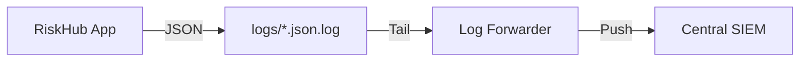

# SIEM Integration Guide

This document describes how to integrate RiskHub structured JSON logs with external SIEM systems like Splunk, Elastic (ELK), or Azure Sentinel.

## Log Forwarding Architecture

RiskHub follows the **Log Forwarding** pattern (Option A). The application writes structured JSON logs to specific files, which are then picked up by a lightweight agent (e.g., Filebeat, Splunk Universal Forwarder) and forwarded to the central SIEM.



## Log Files

- **`logs/audit.json.log`**: High-value security and audit events. **Primary target for SIEM ingestion.**
- **`logs/app.json.log`**: General application logs (debug, info, error).

## Schema Reference (Audit Log)

Every line is a valid JSON object with the following fields:

| Field | Type | Description |
|-------|------|-------------|
| `timestamp` | string | ISO 8601 UTC timestamp |
| `level` | string | Log level (usually `info` for audit) |
| `event` | string | The action performed (e.g., `login`, `create_risk`) |
| `logger` | string | Source logger (always `audit` for audit logs) |
| `request_id` | string | Unique UUID for the request |
| `user_id` | integer | ID of the user performing the action |
| `client_ip` | string | IP address of the client |
| `feature` | string | Feature area (usually `audit`) |
| `*` | object | Additional context fields based on the event |

## Integration Examples

### 1. Elastic Filebeat

Add this to your `filebeat.yml`:

```yaml
filebeat.inputs:
- type: filestream
  id: riskhub-audit
  paths:
    - /path/to/riskhub/backend/logs/audit.json.log
  parsers:
    - ndjson:
        keys_under_root: true
        overwrite_keys: true
        add_error_key: true
        message_key: event

output.elasticsearch:
  hosts: ["localhost:9200"]
  index: "riskhub-audit-%{+yyyy.MM.dd}"
```

### 2. Splunk Universal Forwarder

Add to `inputs.conf`:

```ini
[monitor:///path/to/riskhub/backend/logs/audit.json.log]
index = riskhub_audit
sourcetype = _json
```

## Security & Privacy

- Logs do NOT contain passwords or authentication tokens.
- IP addresses are logged for forensic purposes.
- Rotation is handled by the application (Standard: 10MB x 10 files).
