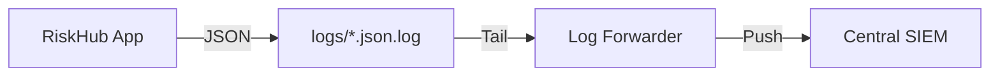

# SIEM Integration Guide

This document describes how to integrate RiskHub structured JSON logs with external SIEM systems like Splunk, Elastic (ELK), or Azure Sentinel.

## Log Forwarding Architecture

RiskHub follows the **Log Forwarding** pattern (Option A). The application writes structured JSON logs to specific files, which are then picked up by a lightweight agent (e.g., Filebeat, Splunk Universal Forwarder) and forwarded to the central SIEM.



## Log Files

| File | Purpose | SIEM Priority |
|------|---------|---------------|
| `backend/logs/audit.json.log` | Security and audit events | **Primary** - ingest this |
| `backend/logs/app.json.log` | General application logs | Secondary - for debugging |

> **Note**: Logs are written to `backend/logs/`, not `backend/app/logs/`.

## Schema Reference (Audit Log)

Every line is a valid JSON object with the following fields:

| Field | Type | Description | Always Present |
|-------|------|-------------|----------------|
| `timestamp` | string | ISO 8601 UTC timestamp | ✓ |
| `level` | string | Log level (usually `info` for audit) | ✓ |
| `event` | string | The action performed (e.g., `login`, `create`) | ✓ |
| `logger` | string | Source logger (always `audit` or `audit.*`) | ✓ |
| `request_id` | string | Unique UUID for the request | When available |
| `user_id` | integer | ID of the user performing the action | When authenticated |
| `client_ip` | string | IP address of the client | When available |
| `feature` | string | Feature area (usually `audit`) | ✓ |
| `actor_id` | integer | Same as user_id (for consistency) | When authenticated |
| `actor_name` | string | Display name of the actor | When authenticated |
| `entity_type` | string | Type of entity (risk, control, kri, user) | ✓ |
| `entity_id` | integer | ID of the affected entity | ✓ |
| `entity_name` | string | Display name of the entity | ✓ |
| `changes` | object | Field-level diff for updates | On UPDATE events |
| `description` | string | Human-readable description | ✓ |

## Log Rotation Configuration

Rotation settings are configured via the Admin Console (Risk Hub > Settings > Log Configuration).

| Setting | Default | Description |
|---------|---------|-------------|
| `log_rotation_size_mb` | 10 | Max size per log file before rotation (MB) |
| `log_retention_count` | 10 | Number of backup files to keep |

**When changes apply:**
- Settings are applied **on backend restart**
- The lifespan handler reads config from database and reconfigures handlers
- Rotated files are named `*.json.log.1`, `*.json.log.2`, etc.

## Integration Examples

### 1. Elastic Filebeat

Add this to your `filebeat.yml`:

```yaml
filebeat.inputs:
- type: filestream
  id: riskhub-audit
  paths:
    - /path/to/riskhub/backend/logs/audit.json.log
  parsers:
    - ndjson:
        keys_under_root: true
        overwrite_keys: true
        add_error_key: true
        message_key: event

output.elasticsearch:
  hosts: ["localhost:9200"]
  index: "riskhub-audit-%{+yyyy.MM.dd}"
```

### 2. Splunk Universal Forwarder

Add to `inputs.conf`:

```ini
[monitor:///path/to/riskhub/backend/logs/audit.json.log]
index = riskhub_audit
sourcetype = _json
```

### 3. Azure Log Analytics (via Filebeat)

```yaml
output.logstash:
  hosts: ["<logstash-host>:5044"]
# Or use the Azure monitor output
```

## Verification Script

RiskHub provides `backend/scripts/verify_audit_logs.py` to validate log integrity:

```bash
cd backend
python scripts/verify_audit_logs.py
```

The script checks:
- ✓ Valid JSON format
- ✓ Required SIEM fields present
- ✓ Logger name is `audit` or `audit.*` (separation enforcement)
- ✓ No password/secret leakage

## Security & Privacy

- Logs do NOT contain passwords or authentication tokens
- Failed login attempts use consistent messaging (no user existence disclosure)
- IP addresses are logged for forensic purposes
- Audit log entries are immutable (append-only in database)

## Troubleshooting

| Issue | Solution |
|-------|----------|
| Empty audit log | Check `backend/logs/` exists and is writable |
| Missing user_id | User was not authenticated for that request |
| Rotation not working | Restart backend after changing config |
| Audit entries in app log | Check NonAuditFilter is configured |
